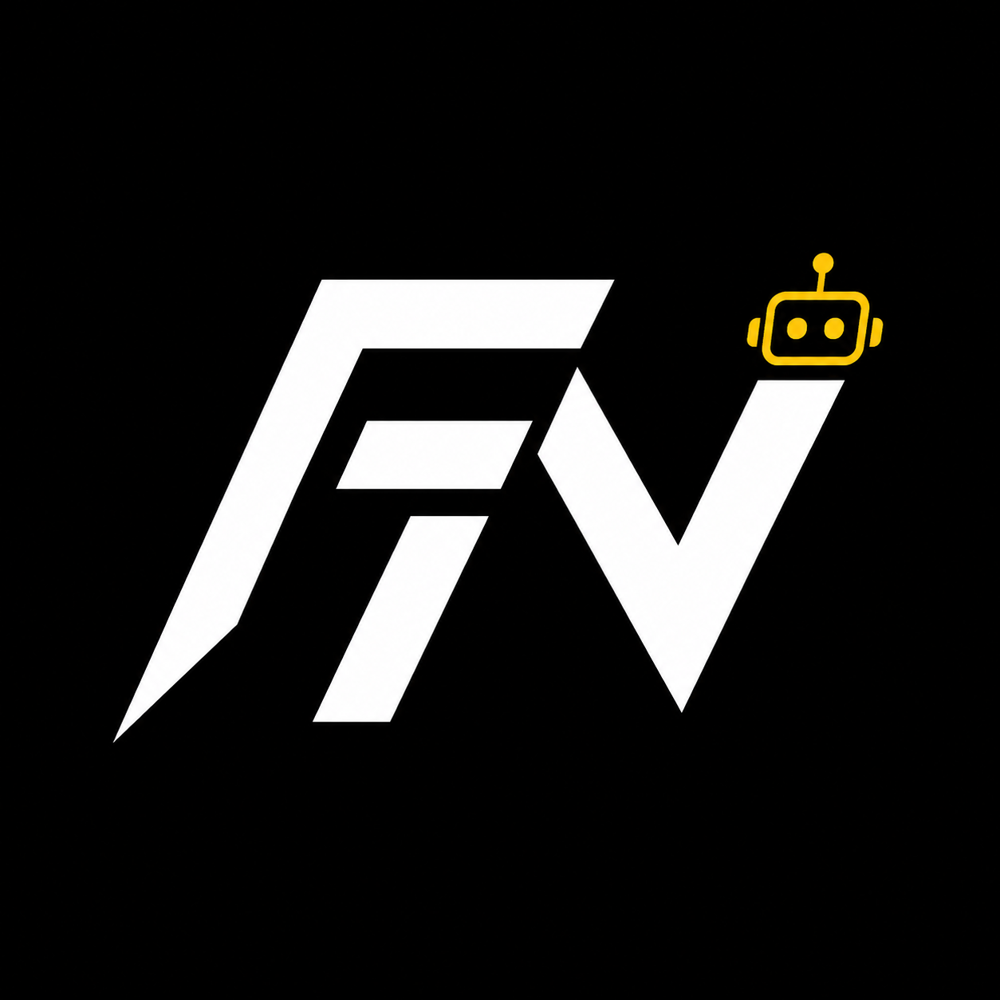

<p align="center">
  
</p>

# Frontier Core

Official Discord bot for Frontier Networks, built with Node.js, TypeScript, discord.js v14, Prisma, and SQLite for local development.

Frontier Core is designed as one codebase for multiple Discord servers. Each guild stores its own language, timezone, channels, categories, and staff roles in the database.

## Features

- Slash commands, buttons, modals, and Frontier-branded embeds
- Per-guild configuration with English and Turkish localization
- Ticket panels with private ticket channels, claim, and close controls
- Modal-based applications for whitelist, staff, LSPD, BCSO, and EMS
- Rank request workflow with staff review buttons
- Temporary private voice lounges with owner controls and empty-room cleanup
- Welcome messages and moderation/log events
- Rotating bot activity advertising Frontier expansion plans
- Branded `/about` embed with Frontier logo support
- Local Frontier logo library in `assets/logos/`
- SQLite local database through Prisma

## Requirements

- Node.js 20.11 or newer
- A Discord application and bot token
- Server permissions for managing channels, roles, messages, and slash commands
- Enabled Discord Developer Portal intents:
  - Server Members Intent
  - Message Content Intent

## Setup

```bash
npm install
cp .env.example .env
npm run prisma:generate
npm run prisma:migrate -- --name init
npm run dev
```

On Windows PowerShell, create the environment file with:

```powershell
Copy-Item .env.example .env
```

Fill in `.env`:

```env
DISCORD_TOKEN=
DISCORD_CLIENT_ID=
DATABASE_URL="file:./dev.db"
FRONTIER_LOGO_URL=
FRONTIER_COVER_URL=
```

`FRONTIER_LOGO_URL` is optional. Use a public CDN URL if you want Discord embeds to show the bot logo.
`FRONTIER_COVER_URL` is optional. Use it for a wide banner image in branded embeds such as `/about`.

## Scripts

- `npm run dev` starts the bot with `tsx watch`
- `npm run build` compiles TypeScript into `dist/`
- `npm run start` runs the compiled bot
- `npm run app:profile` updates the Discord app profile description, icon, tags, and cover image
- `npm run prisma:generate` generates the Prisma client
- `npm run prisma:migrate` creates or applies local SQLite migrations

## First Run

When Frontier Core joins a server, it creates a default `GuildConfig` row. If the guild name includes `Türkiye`, `Turkiye`, or `Turkish`, the default language is Turkish. Otherwise the default language is English.

Run this in each server to configure the modules:

```text
/admin config
```

Recommended values:

- `language`
- `timezone`
- `log-channel`
- `welcome-channel`
- `ticket-category`
- `application-category`
- `private-voice-category`
- `support-role`
- `staff-role`
- `admin-role`

Review configuration with:

```text
/admin config-view
```

## App Profile Polish

Discord app profile visuals are controlled by the Developer Portal/application resource, not slash-command code. Frontier Core includes a profile updater that pushes the app bio/description, tags, icon, and Rich Presence invite cover image from local assets:

```powershell
npm.cmd run app:profile
```

It uses:

- `assets/logos/FrontierBot.png` for the app icon
- `assets/covers/FrontierCover.png` for the default Rich Presence invite cover
- description text advertising tickets, applications, rank requests, voice lounges, staff tools, USA/Australia/Turkiye, and Roblox/Garry's Mod/Rust/FiveM
- tags: `frontier`, `support`, `roleplay`, `fivem`, `gaming`

## Frontier HQ Defaults

Frontier Core recognizes the current HQ layout shown in the server sidebar:

- `Information`: `rules`, `announcements`, `developer-showcase`
- `Community`: `general`, `off-topic`, `highlights`, public/private voice channels, `Awaiting Training`
- `Support`: `ticket`, `rank-request`, `Awaiting Drag`, `Support #1`, `Support #2`, `Support #3`
- `Feedback`: `suggestions`, `polls`
- `Staff`: `staff-announcements`, `game-master-announcements`, `staff-chat`, `game-master-chat`, `proof-archive`, `auto-mod-log`, `discord-moderation-updates`, staff voice channels, manager lounge, meetings, training
- `Personal VCs`: personal voice channels
- `Upper Echelon`: leadership discussion channels

When a guild config is created or refreshed, the bot will auto-fill empty config fields from that layout where possible:

- `Support` category for tickets
- `Support` category for applications
- `Personal VCs` category for private lounges
- `general` for welcomes
- `auto-mod-log`, `discord-moderation-updates`, or `staff-chat` for logs

Manual `/admin config` values always win over auto-detected defaults.

## Frontier Turkiye Defaults

Frontier Core also recognizes the current `Frontier Networks Turkiye` FiveM-focused layout:

- `Bilgilendirme`: `kurallar`, `duyurular`
- `Topluluk`: `genel-sohbet`, `sohbet-2`, `medya-ve-klip`, public voice channels, private voice channels, training wait room
- `FiveM`: `fivem-duyurular`, `rol-rehberi`, `karakter-kayitlari`, FiveM public voice channels
- `LSPD`: `arananlar`, `lspd-basvuru`, `lspd-sohbet`, `delil-arsivi`, patrol and command voice channels
- `EMS`: `yaralilar`, `ems-basvuru`, `ems-sohbet`, ambulance and command voice channels
- `Destek Merkezi`: `destek-talebi`, `rutbe-talebi`, support waiting room, support voice channels
- `Geri Bildirim`: `oneriler`, `anketler`
- `Yetkili Merkezi`: `yetkili-sohbet`, `rol-yoneticisi-sohbet`, `kanit-arsivi`, `otomod-kayitlari`, `moderasyon-guncellemeleri`, staff voice channels
- `Ozel Odalar`: private personal voice channels
- `Yonetim Kurulu`: board discussion channels

For this branch, empty config fields are auto-filled as:

- `Destek Merkezi` category for tickets
- `FiveM` category for applications
- `Ozel Odalar` category for private lounges
- `genel-sohbet` for welcomes
- `otomod-kayitlari`, `moderasyon-guncellemeleri`, or `yetkili-sohbet` for logs
- Turkish language and `Europe/Istanbul` timezone by default when the guild name contains `Türkiye`, `Turkiye`, or Turkish-style wording

## Presence

The bot rotates its Discord activity to advertise Frontier's planned regions and supported platforms:

- USA • Australia • Turkiye
- Roblox • Garry's Mod • Rust • FiveM
- Frontier Networks expansion
- /help • tickets • applications

Discord's Rich Presence image assets and fields such as `largeImageKey`, `smallImageKey`, party size, and join secrets are for game/client integrations, not normal bot member-list presence. The bot uses Discord's supported bot activity fields, while branded commands use the local logo library and the planned FiveM client/resource integration should use the uploaded Rich Presence asset keys. See [docs/fivem-rich-presence.md](./docs/fivem-rich-presence.md).

## Commands

- `/help`
- `/about`
- `/ping`
- `/server`
- `/status`
- `/admin config`
- `/admin config-view`
- `/ticket panel`
- `/ticket create`
- `/apply whitelist`
- `/apply staff`
- `/apply lspd`
- `/apply bcso`
- `/apply ems`
- `/rank-request`
- `/lounge create`
- `/lounge lock`
- `/lounge unlock`
- `/lounge invite`
- `/lounge rename`

## Project Structure

```text
src/
  index.ts
  client.ts
  config/
  database/
  i18n/
  commands/
  events/
  modules/
  utils/
  types/
```

## Notes

Application and rank review buttons are sent to the configured log channel. Ticket channels are private to the requester and configured support, staff, and admin roles. Temporary lounge records are removed automatically when the voice channel becomes empty.
